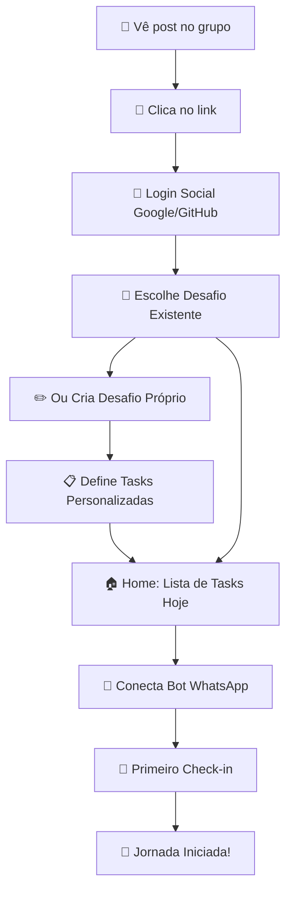

# 🧠 DOPA Check

<div align="center">

**Transforme seu WhatsApp em um tracker de hábitos inteligente**

*Um projeto open-source que nasceu da necessidade real de centralizar o acompanhamento de hábitos saudáveis sem fricção*

[](https://choosealicense.com/licenses/mit/)
[](https://laravel.com)
[](https://vuejs.org)
[](https://whatsapp.com)

[🚀 Demo Live](#) • [📖 Documentação](#funcionalidades) • [🎯 Como Usar](#como-funciona) • [🛠️ Instalação](#instalação)

</div>

---

## 🧩 O Problema que Resolve

> **"Eu usava vários apps (Strava, Notion, Google Keep), mas nada centralizava meu progresso real de hábitos. Então criei o DOPA Check para simplesmente enviar uma imagem via WhatsApp e acompanhar minha jornada completa."**

**DOPA Check** nasceu da comunidade [Reservatório de Dopamina](https://t.me/reservatoriodedopamina), onde desafios como *"7 dias de leitura"*, *"21 dias sem açúcar"* são comuns, mas o acompanhamento era fragmentado e trabalhoso.

### 💡 A Solução
- ✅ **Zero apps extras** - Use o WhatsApp que você já tem
- ✅ **Check-in por imagem** - Uma foto vale mais que mil planilhas
- ✅ **Progresso visual** - Veja sua evolução em tempo real
- ✅ **Compartilhamento viral** - Mostre suas conquistas para o mundo
- ✅ **IA Inteligente** - Analisa suas fotos automaticamente (Premium)

---

## 🚀 Funcionalidades

### 🆓 **Versão Gratuita**
- **Login social** sem fricção (Google/GitHub)
- **1 desafio ativo** com tasks personalizadas
- **Check-ins manuais** via WhatsApp ou Web
- **Dashboard pessoal** com progresso visual
- **Bot WhatsApp** com número único
- **Perfil público** para compartilhar (`/u/seu-nome`)
- **Imagens básicas** para stories (90 dias TTL)
- **Participação** em desafios populares da comunidade

### 🤖 **DOPA Check PRO**
- **Desafios ilimitados** simultâneos
- **IA Vision Agent** que analisa imagens automaticamente
- **Storage permanente** de todas as imagens
- **Templates personalizados** de compartilhamento
- **Analytics avançados** com insights
- **Respostas do bot** personalizadas
- **Suporte prioritário** e features beta

---

## 🎯 Como Funciona

### 🚀 **Onboarding Simplificado (3 cliques)**



### 📋 **Fluxo Detalhado**

#### **1. Descoberta Orgânica**
- **Post no grupo**: *"Criei o DOPA Check para resolver nossos desafios de hábitos... [link]"*
- **Landing page** com explicação clara do problema/solução
- **Login social** (Google/GitHub) - zero fricção

#### **2. Escolha do Desafio**
```
Tela: "Escolha seu desafio"
┌────────────────────────────────────────┐
│ 🔥 Desafios Populares                  │
├────────────────────────────────────────┤
│ 📚 21 dias de leitura (847 pessoas)    │
│ 🏃 30 dias de exercício (623 pessoas)  │
│ 💧 7 dias bebendo 2L água (412 pessoas)│
│ 🧘 14 dias de meditação (289 pessoas)  │
├────────────────────────────────────────┤
│ ➕ Criar meu próprio desafio           │
└────────────────────────────────────────┘
```

#### **3. Criação Personalizada** (se escolher)
```
Formulário simples:
- Nome do desafio: "Minha jornada fitness"
- Duração: [21] dias
- Tasks diárias:
  ✅ #treino - Exercitar 30min
  ✅ #agua - Beber 2L de água  
  ✅ #sono - Dormir antes das 23h
  [+ Adicionar task]
```

#### **4. Home Dashboard**
```
┌─────────────────────────────────────┐
│ 🎯 Dia 3 de 21 - "21 dias leitura"  │
├─────────────────────────────────────┤
│ Hoje - Quinta, 04 Jul               │
│                                     │
│ ⏳ #leitura - Ler 30min             │
│    [📸 Check-in] [✅ Concluído]     │
│                                     │
│ ✅ #agua - Beber 2L                 │
│    ✓ Feito às 14:30                │
├─────────────────────────────────────┤
│ 🤖 [Bot WhatsApp] 📊 [Relatórios]   │
│ 🔗 [Meu Perfil]   ⚙️ [Config]       │
└─────────────────────────────────────┘
```

#### **5. Conexão com Bot**
```
Modal: "Conectar WhatsApp"
┌─────────────────────────────────────┐
│ 🤖 Seu Bot Pessoal                  │
│                                     │
│ 📱 (71) 9999-0000                   │
│ 💾 [Salvar Contato]                 │
│                                     │
│ 📝 Como usar:                       │
│ 1. Salve o número                   │
│ 2. Envie foto + #hashtag            │
│ 3. Receba confirmação automática    │
│                                     │
│ 💡 Exemplo: Foto da corrida + "#treino"│
└─────────────────────────────────────┘
```

---

## 🚀 Funcionalidades Detalhadas

### 🎯 **Sistema de Desafios**
- **Desafios populares** com contador de participantes
- **Criação personalizada** com tasks customizadas
- **1 desafio ativo** por usuário (foco total)
- **Saída livre** a qualquer momento (dados preservados)

### 📋 **Tasks Inteligentes**
- **Hashtags únicas** por task (`#leitura`, `#treino`, `#agua`)
- **Status visual** (pendente/concluído/atrasado)
- **Timeline diária** com horários de conclusão
- **Streak counter** para motivação

### 🤖 **Bot WhatsApp Pessoal**
- **Número único** para cada usuário
- **Check-in por foto** + hashtag
- **Confirmações automáticas** em tempo real
- **Geração de imagens** de progresso para compartilhar
- **Link do perfil** enviado automaticamente

### 📊 **Relatórios e Sharing**
- **Dashboard pessoal** com métricas
- **Perfil público** (`/u/seunome`) para compartilhar
- **Imagens auto-geradas** para stories/redes sociais
- **Exportação de dados** completa

### 🆓 **Limitações Freemium**
```php
'free_limits' => [
    'active_challenges' => 1,
    'image_retention_days' => 90, // TTL para economia storage
    'manual_checkins' => true,
    'ai_analysis' => false,
    'custom_sharing_templates' => false
]

'pro_benefits' => [
    'unlimited_challenges' => true,
    'permanent_image_storage' => true,
    'ai_auto_checkin' => true,
    'advanced_analytics' => true,
    'custom_bot_responses' => true,
    'priority_support' => true
]
```

---

## 🛠️ Estrutura Técnica do MVP

### 📊 **Banco de Dados Simplificado**
```sql
-- Tabelas essenciais para MVP
users (id, name, email, avatar, created_at)
challenges (id, title, duration_days, is_template, created_by)
challenge_tasks (id, challenge_id, name, hashtag, description)
user_challenges (id, user_id, challenge_id, started_at, status)
checkins (id, user_challenge_id, task_id, image_url, checked_at)
```

### 🔄 **Jobs e Queues**
```php
// Jobs essenciais para performance
ProcessWhatsAppMessage::class    // Webhook WhatsApp
GenerateProgressImage::class     // Imagem para sharing  
SendDailyReminder::class         // Lembretes opcionais
CleanupExpiredImages::class      // TTL para storage
CalculateUserStats::class        // Métricas do perfil
```

### 📱 **Componentes Vue Principais**
```
/resources/js/Pages/
├── Landing.vue              # Landing page
├── ChallengeSelector.vue    # Escolha/criação de desafio
├── Dashboard.vue            # Home com tasks do dia
├── Reports.vue              # Relatórios pessoais
├── Profile.vue              # Perfil público
└── Settings.vue             # Configurações

/resources/js/Components/
├── TaskCard.vue             # Card de task com check-in
├── ProgressBar.vue          # Visualização de progresso
├── ChallengeCard.vue        # Card de desafio
├── WhatsAppBot.vue          # Modal conexão bot
└── ShareModal.vue           # Modal compartilhamento
```

### 🤖 **API WhatsApp Simplificada**
```php
// Endpoints essenciais
POST /api/webhook           // Recebe mensagens WhatsApp
GET  /api/bot-number/{user} // Número do bot para usuário
POST /api/checkin          // Check-in manual via web
GET  /api/progress-image/{user} // Gera imagem compartilhamento
```

---

## 📦 Instalação Rápida

### Pré-requisitos
- PHP 8.3+
- Node.js 18+
- MySQL 8.0+
- Redis
- [EvolutionAPI](https://github.com/EvolutionAPI/evolution-api) configurada

### 🚀 Deploy em 5 minutos

```bash
# 1. Clone o repositório
git clone https://github.com/raphaieu/dopacheck.com.br.git
cd dopa-check

# 2. Instale dependências
composer install
npm install

# 3. Configure ambiente
cp .env.example .env
php artisan key:generate

# 4. Configure banco e Redis
php artisan migrate --seed

# 5. Build assets
npm run build

# 6. Configure queues
php artisan horizon:install
php artisan horizon:start

# 7. Configure webhook da EvolutionAPI
# Endpoint: https://dopacheck.com.br/api/webhook
```

### ⚙️ Variáveis de Ambiente Essenciais

```env
# EvolutionAPI
EVOLUTION_BASE_URL=https://sua-evolution-api.com
EVOLUTION_API_KEY=sua_api_key

# OpenAI (Premium)
OPENAI_API_KEY=sk-sua_openai_key

# Stripe (Premium)
STRIPE_KEY=pk_sua_stripe_key
STRIPE_SECRET=sk_sua_stripe_secret

# Cloudflare R2 (Imagens)
CLOUDFLARE_R2_ACCESS_KEY_ID=sua_access_key
CLOUDFLARE_R2_SECRET_ACCESS_KEY=sua_secret_key
```

---

## 📊 Métricas e Performance

### 🎯 **Benchmarks Atuais**
- ⚡ **Response Time**: < 200ms (API)
- 🤖 **Bot Response**: < 2s (webhook processing)
- 🧠 **IA Analysis**: < 5s (OpenAI Vision)
- 📈 **Uptime**: 99.9% (objetivo)

### 📈 **Métricas de Produto**
- 👥 **Usuários Ativos**: Crescendo 🚀
- ✅ **Taxa de Conclusão**: 68% dos desafios iniciados
- 💰 **Conversão Premium**: 15% dos usuários ativos
- 🔄 **Retenção D7**: 73%

---

## 🧪 Roadmap & Visão de Futuro

### 🎯 **Próximas Releases**

#### v1.1 - Comunidades (4 semanas)
- [ ] Grupos de desafio compartilhados
- [ ] Rankings entre amigos
- [ ] Eventos comunitários

#### v1.2 - Integrações (6 semanas)
- [ ] Strava, Fitbit, Apple Health
- [ ] Google Calendar (lembretes)
- [ ] Notion, Obsidian (journaling)

#### v1.3 - IA Avançada (8 semanas)
- [ ] Análise de sentimento
- [ ] Sugestões personalizadas
- [ ] Coaching automatizado

### 🌟 **Visão 2025**
Transformar o DOPA Check na **plataforma definitiva de hábitos dopaminérgicos**, integrando:
- 🧠 **Neurociência** aplicada
- 🤝 **Comunidades engajadas**
- 📊 **Analytics preditivos**
- 🎮 **Gamificação inteligente**

---

## 🤝 Como Contribuir

Adoramos contribuições! Este projeto é **open-source** para que possamos construir juntos a melhor experiência de tracking de hábitos.

### 🛠️ **Formas de Contribuir**
- 🐛 **Bug Reports**: [Issues](https://github.com/seuusuario/dopa-check/issues)
- 💡 **Feature Requests**: [Discussions](https://github.com/seuusuario/dopa-check/discussions)
- 🔧 **Pull Requests**: Sempre bem-vindos!
- 📖 **Documentação**: Melhore este README
- 🎨 **Design/UX**: Componentes e fluxos
- 🧪 **Testing**: Casos de teste e QA

### 🎯 **Issues em Aberto**
- [ ] **[Good First Issue]** Adicionar templates de desafio
- [ ] **[Enhancement]** Dark mode para dashboard
- [ ] **[Feature]** Integração com Google Fit
- [ ] **[Bug]** Fix timezone em lembretes

### 📋 **Guidelines**
1. Fork o repositório
2. Crie branch: `git checkout -b feature/amazing-feature`
3. Commit: `git commit -m 'Add amazing feature'`
4. Push: `git push origin feature/amazing-feature`
5. Abra Pull Request

---

## 💰 Modelo de Negócio

### 🎯 **Sustentabilidade Open-Source**
O DOPA Check é **free forever** para uso pessoal, com modelo **freemium** que sustenta o desenvolvimento:

| **Feature** | **Gratuito** | **PRO (R$ 19/mês)** |
|-------------|--------------|-------------------|
| Desafios | 3 ativos | Ilimitados |
| Check-ins | Manuais | IA Automática |
| Análise | Básica | Avançada + Insights |
| Compartilhamento | Público | Personalizado |
| Suporte | Comunidade | Prioritário |

### 🎁 **Para Desenvolvedores**
- ✅ **Código 100% aberto**
- ✅ **Documentação completa**
- ✅ **APIs públicas**
- ✅ **Self-hosting suportado**

---

## 📞 Contato & Suporte

<div align="center">

### 👨‍💻 **Criado por Raphael Martins**

*FullStack Developer • Laravel Specialist • Open Source Advocate*

[](https://github.com/raphaieu)
[](https://linkedin.com/in/raphaelmartins)
[](https://twitter.com/raphaieu)
[](https://instagram.com/raphaieu)

**📧 Email**: [rapha@raphael-martins.com](mailto:rapha@raphael-martins.com)  
**💬 WhatsApp**: [(11) 94886-3848](https://wa.me/5511948863848)  
**🌐 Website**: [raphai.eu](https://raphai.eu)

</div>

### 💼 **Disponível para Projetos**
Precisa de um **FullStack Developer** experiente? Estou disponível para:
- 🚀 **Desenvolvimento de MVPs**
- 🏗️ **Arquitetura de sistemas**
- 🤖 **Integração de IA**
- 📱 **Aplicações WhatsApp**
- 🔧 **Mentoria técnica**

---

## 📄 Licença

Este projeto está sob a licença **MIT**. Veja o arquivo [LICENSE](LICENSE) para mais detalhes.

**TL;DR**: Faça o que quiser com o código, mas mantenha os créditos! 😉

---

<div align="center">

**⭐ Se este projeto te ajudou, deixe uma estrela!**

*Construído com ❤️ por [Raphael Martins](https://raphai.eu) • Salvador, BA 🇧🇷*

**#VibeCoding #OpenSource #Laravel #FullStack #WhatsApp #IA**

</div>